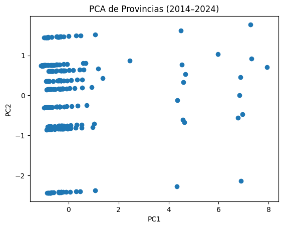
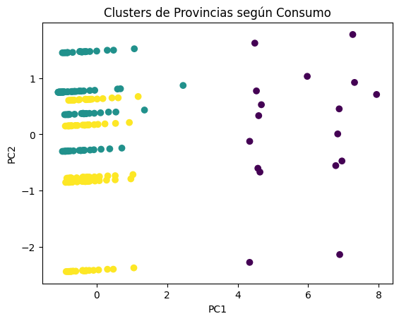

# Clustering & PCA de Patrones de Consumo

**Objetivo**: Identificar segmentos de clientes por comportamiento energético usando **K-Means** y **PCA**.

## 🔢 Técnicas
- Estandarización (`StandardScaler`).
- Reducción de dimensionalidad con **PCA**.
- Selección de *k* por **Elbow** y **Silhouette**.

## 📊 Resultados

### PCA de Provincias
Reducción de dimensionalidad a 2 componentes principales (PCA).



### Clusters de Provincias según Consumo
Segmentación con **K-Means (k=3)** sobre los datos energéticos.



### Métricas de validación
- **Coeficiente de Silhouette:** 0.40 → separación moderada entre clusters.


## ▶️ Cómo ejecutar
```bash
pip install -r requirements.txt
jupyter lab
```
Abrir `notebook.ipynb` y seguir las celdas.

## 📊 Entregables
- Gráficas PCA 2D/3D con clusters.
- Métricas de calidad de clusters.
- Reglas/insights por segmento.
