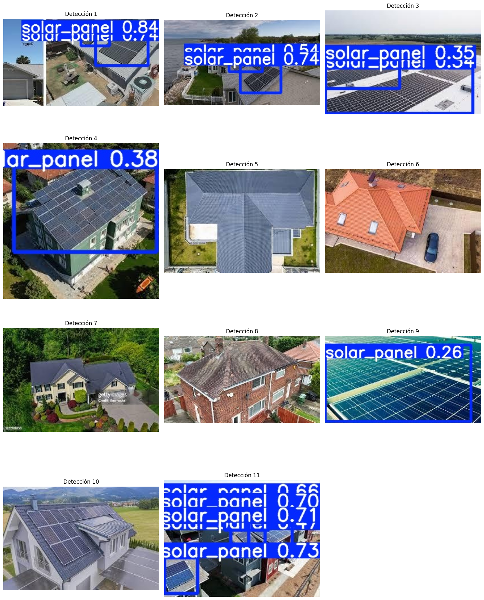

# Detección de Paneles Solares con YOLOv5

**Objetivo**: Entrenar un modelo de detección de objetos para identificar paneles solares en imágenes aéreas, utilizando **YOLOv5**.

## 📦 Datos
- Dataset creado y anotado manualmente con bounding boxes.
- Formato: YOLO TXT.
- Cantidad: 100 imágenes.

## 🧠 Modelo
- Arquitectura: **YOLOv5s**.
- Entrenado con transferencia de aprendizaje a partir de pesos preentrenados.
- Librerías: PyTorch, Ultralytics YOLO.

## 🔧 Pipeline
1. Anotación manual de imágenes (LabelImg).
2. Conversión de dataset a formato YOLO.
3. Entrenamiento de modelo.
4. Evaluación en imágenes de test.
5. Exportación de resultados en HTML y PNG.

## 📊 Resultados
Ejemplo de detecciones en imágenes de prueba:

- **mAP@0.5**: 42.7 %  
- **Precisión**: 67 %  
- **R**: 42.9% 

También se incluye un reporte en HTML:  
[YOLO_PanelesSolares.html](./resultados/YOLO_PanelesSolares.html)

---

## 📁 Estructura
Deteccion_Objetos_YOLO/
├── data/
├── notebooks/
│ └── yolo_paneles.ipynb
├── resultados/
│ ├── detecciones.png
│ └── YOLO_PanelesSolares.html
└── README.md
